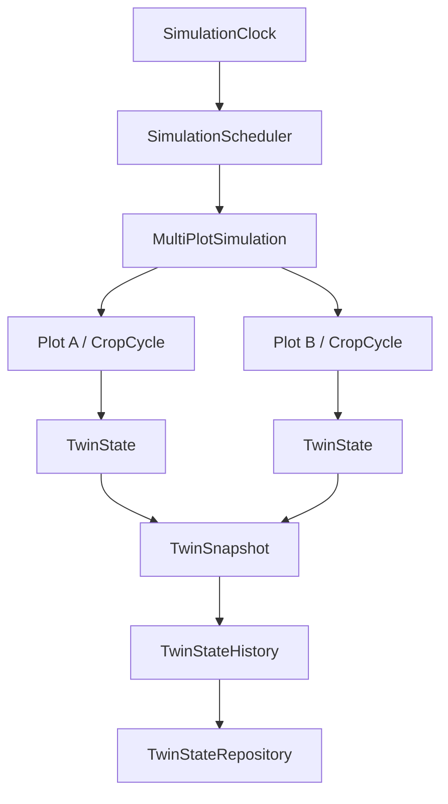

# Phase 5.11: TwinState and temporal history

## Objetivo

Phase 5.11 conserva y consulta el estado simulado de cada parcela y ciclo en cada instante gobernado por `SimulationClock`. No introduce base de datos, IoT, data assimilation, machine learning, calibración ni validación experimental.

## Identidad y estado

`SyntheticPlot` identifica la parcela y `SyntheticCropCycle` identifica una instancia productiva. `TwinState` representa el estado simulado de un `plot_id`, `cycle_id` y `simulation_time`. Incluye estado de ciclo, fase, provenance `SIMULATION` y las variables meteorológicas disponibles sin convertir el estado en una `Observation`.

`TwinSnapshot` representa todos los `TwinState` disponibles en un mismo instante. Sus estados están ordenados por `plot_id` y `cycle_id`; no depende del orden accidental de diccionarios o del filesystem.

## Historial y repository

`TwinStateRepository` define el contrato mínimo de estado temporal. `InMemoryTwinStateRepository` es la implementación actual, sin red, filesystem ni reloj de pared. Permite:

- `save()` y `save_snapshot()`;
- `get_exact()`;
- `latest_at_or_before()` sin interpolación;
- `latest()`;
- `history(plot_id, cycle_id)`;
- `snapshot(simulation_time)`;
- `latest_snapshot()`.

La clave lógica es `(plot_id, cycle_id, simulation_time)`. Guardar dos veces el mismo objeto es idempotente. Guardar otro valor para la misma clave produce `TwinStateConflict`. Un snapshot valida todos sus conflictos antes de mutar el repositorio, por lo que el commit es atómico.

## Integración temporal

`MultiPlotSimulation` sigue siendo el único orquestador multi-parcela. Cada tick calcula resultados en una copia de los estados, ejecuta el callback de los motores existentes y solo después guarda un `TwinSnapshot`. Si el cálculo falla, no se actualizan ni el historial ni el estado mutable. Un segundo cálculo del mismo timestamp devuelve el resultado ya comprometido y no duplica el historial.

Los motores de crecimiento, fenología, agua, greenhouse y feedback calculan; la capa de aplicación conserva. Las iteraciones internas del feedback, si existen, no crean timestamps adicionales.

## Ciclos y estados

Se conservan por separado ciclos anuales, ciclos cortos y perennes. Un ciclo preplanting o post-harvest sigue siendo consultable cuando el resolver puede identificarlo. Un ciclo terminado no se borra; un nuevo ciclo tiene una clave y un historial independientes. Los cambios de año no reinician el repository ni el `SimulationClock`.

Cuando no existe ciclo en una parcela, el resultado multi-parcela mantiene `NO_ACTIVE_CYCLE` y no crea un cultivo ficticio. Los campos no producidos por los motores permanecen en `None`; `None` no se convierte silenciosamente en cero.

## Provenance y observaciones

`TwinState.state_provenance` es siempre `SIMULATION`. `weather_source` conserva `SYNTHETIC`, `USER_SCENARIO`, `REAL_WORLD` u `OPEN_METEO` cuando el proveedor lo expone. El estado simulado no se convierte automáticamente en `Observation` y las observaciones reales siguen entrando por `ObservationIngestion` hacia `ObservationDataset`, `CalibrationCase` o `ValidationCase`.

## Serialización

`TwinState.to_dict()` produce un diccionario JSON-compatible y `TwinState.from_dict()` lo reconstruye preservando timestamps, identidad, unidades implícitas de los campos y provenance. No se implementa almacenamiento físico.

## Tests y manual

Los tests están en `tests/test_twin_state_history.py` y cubren consultas, serialización, duplicados, atomicidad, multi-ciclo, cambio de año, determinismo, provenance y fallos. El manual es `manual_phase5_11_twin_state_history_test.py`.

## Limitaciones

No se implementan persistencia SQL/Redis, estado distribuido, IoT, checkpoints/restore, interpolación, corrección basada en observaciones, sensor fusion, data assimilation, forecasting, ML, TimesFM, calibración ni validación experimental. El repository en memoria es sustituible posteriormente por una infraestructura persistente sin convertirla en dependencia de los motores fisiológicos.

**PHASE 5.11 COMPLETE — TEMPORAL TWIN STATE MANAGEMENT READY — MULTI-PLOT SNAPSHOTS READY — STATE HISTORY READY — SYNTHETIC DATA ONLY — CALIBRATION NOT PERFORMED — EXPERIMENTAL VALIDATION NOT CLAIMED**
