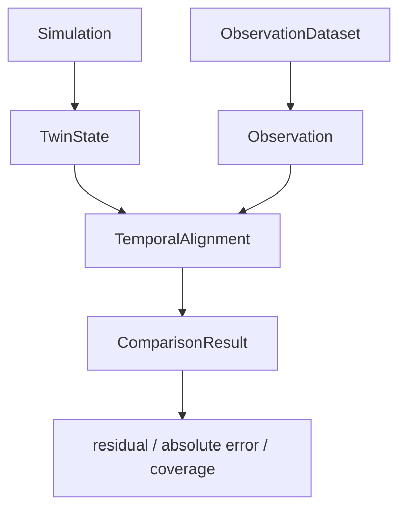

# Phase 5.12: TwinState and Observation temporal alignment

## Objetivo y frontera

Phase 5.12 conecta de forma pasiva el estado simulado del gemelo con observaciones ingeridas para saber qué estado corresponde comparar. `TwinState` y `Observation` siguen siendo modelos distintos. La comparación no modifica el estado, no avanza `SimulationClock`, no asimila observaciones y no ejecuta calibración.



## Contratos y contexto

`TemporalAlignment` reutiliza `AlignmentPolicy` de validación y soporta `EXACT`, `SAME_DAY` y `NEAREST`. `AlignmentResult` conserva estado, timestamps, delta, política, contexto y resolución del ciclo (`EXPLICIT`, `INFERRED` o `NOT_RESOLVED`). `Observation.cycle_id` es opcional y solo se conserva cuando viene explícito del CSV o de la API; nunca se inventa silenciosamente.

El matching exige `plot_id` cuando está disponible y comprueba `crop` y `variety`. Un ciclo explícito debe coincidir. Sin ciclo explícito, más de un ciclo candidato produce `AMBIGUOUS`; un único candidato queda marcado como `INFERRED`. No se hace matching crop-only cuando hay identidad de parcela.

## Políticas temporales

- `EXACT`: igualdad de timestamps después de normalizar ambos a UTC.
- `SAME_DAY`: mismo día UTC, seleccionando el estado más cercano.
- `NEAREST`: estado más cercano dentro de `max_time_delta_seconds`; fuera de tolerancia es `NO_MATCH`.
- Empates: `PREVIOUS` por defecto, con opción explícita `NEXT`.

No se usa `imported_at`, modificación de archivos ni reloj del sistema. No se interpola ni se crea un snapshot faltante.

## Variables y unidades

`ComparisonResult` compara únicamente variables compatibles: LAI, biomasa, humedad de suelo, temperatura, humedad relativa, radiación y CO2 cuando existen en `TwinState`. Las unidades observadas pasan por la normalización existente de `ObservationIngestion`; no se crea otro conversor. Unidades incompatibles producen `UNIT_ERROR`. Variables ausentes en el estado producen `MISSING_SIMULATION_VARIABLE`, nunca cero.

El residual se define como:

```text
residual = simulated - observed
absolute_error = abs(residual)
```

La incertidumbre observada se conserva. Los eventos fenológicos no se convierten automáticamente en magnitudes si el `TwinState` no contiene un evento equivalente.

## Calidad y provenance

Observaciones `MISSING`, `INVALID`, `DUPLICATE` y `OUT_OF_RANGE` producen `INVALID_OBSERVATION`. `ESTIMATED` conserva su calidad y puede compararse si el valor es válido. `ComparisonResult` diferencia `observed_provenance` de `simulation_provenance`, que es `SIMULATION`.

El forcing meteorológico no se convierte en observación. Solo `Observation`/`ObservationDataset` procedentes de `ObservationIngestion` participan en la comparación.

## Resultados y cobertura

`ComparisonDataset` conserva un resultado por observación, incluidos `NO_MATCH`, `AMBIGUOUS` e inválidos. Expone conteos por estado, filtros por parcela, cultivo y variedad, y `coverage_ratio = matched_count / total_results`. Cobertura temporal no significa precisión ni validación científica.

La operación es de solo lectura: no modifica `TwinState`, `TwinSnapshot`, `Observation`, `ObservationDataset`, `SimulationClock`, motores ni parámetros. La misma historia, dataset y política producen el mismo resultado serializable mediante `ComparisonResult.to_dict()`.

## Multi-parcela, ciclos y ambientes

El repositorio se consulta por parcela y ciclo, por lo que tomate, pimiento, uva, ciruela y ciclos consecutivos de lechuga permanecen aislados. Los historiales perennes pueden atravesar años sin mezclar ciclos. Para invernadero se compara la variable de microclima almacenada en `TwinState` cuando está disponible; no se sustituye automáticamente por weather exterior.

## Tests y limitaciones

Los tests están en `tests/test_twin_observation_alignment.py` y cubren temporalidad, contexto, variables, unidades, calidad, incertidumbre, determinismo y no mutación. El manual es `manual_phase5_12_twin_observation_alignment_test.py`.

No se implementan calibración, `GridSearchCalibrator`, validación experimental, asimilación, corrección de estado, interpolación, forecasting, ML, TimesFM, base de datos ni persistencia distribuida. La capa queda preparada para alimentar posteriormente `CalibrationCase` o `ValidationCase`, pero no los crea ni ejecuta automáticamente.

**PHASE 5.12 COMPLETE — TEMPORAL TWIN ↔ OBSERVATION ALIGNMENT READY — COMPARISON LAYER READY — NO CALIBRATION PERFORMED — NO DATA ASSIMILATION — EXPERIMENTAL VALIDATION NOT CLAIMED**
