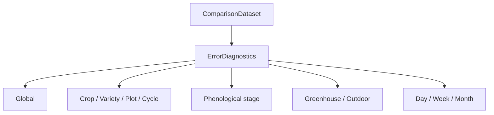

# Phase 5.13: error diagnostics and multilevel evaluation

## Objetivo y frontera

Phase 5.13 transforma `ComparisonDataset` de Phase 5.12 en diagnósticos descriptivos globales y multinivel. No simula, recalibra, modifica `TwinState`, altera observaciones, actualiza parámetros ni realiza data assimilation.



## Métricas

`ErrorDiagnostics` reutiliza `calculate_metrics()` de `domain.calibration`; no crea otra familia de MAE, RMSE, bias o R². El residual conserva la convención de Phase 5.12:

```text
residual = simulated - observed
bias = mean(residual)
MAE = mean(abs(residual))
RMSE = sqrt(mean(residual ** 2))
```

R² queda en `None` cuando la implementación existente no puede calcularlo, por ejemplo con valores observados constantes. Cada `MetricSummary` conserva `n`, conteos de cobertura, calidad, métodos de alineación y estado `NO_DATA` cuando procede. `coverage_ratio` es `matched_count / total del grupo`; cobertura no es accuracy ni model validity.

## Agrupación

Se ofrecen consultas por variable, cultivo, variedad, parcela, ciclo, etapa, entorno y tiempo. El orden es determinista. Las claves de variedad preservan `crop:variety` y las de ciclo `plot_id:cycle_id`, evitando mezclar ciclos de lechuga o años de perennes. `by_time()` admite día, semana ISO y mes usando timestamps de observación normalizados, nunca `imported_at`.

Los grupos se forman a partir de resultados existentes; no se crean grupos ficticios sin datos. Variables o etapas ausentes no se infieren.

## Calidad, provenance y outliers

Las métricas válidas solo usan resultados `MATCHED` con residual numérico. Resultados `MISSING`, `INVALID`, `DUPLICATE`, `UNIT_ERROR`, `OUT_OF_RANGE`, `NO_MATCH` y `AMBIGUOUS` permanecen en el diagnóstico mediante sus conteos y no se eliminan silenciosamente. `ESTIMATED` conserva su conteo separado. Cada resultado mantiene provenance de observación y simulación.

Los outliers son opcionales mediante un umbral absoluto explícito. Se reportan con observación, parcela, ciclo, variable, tiempos y valores, pero nunca se eliminan. Un outlier no implica automáticamente mala observación ni modelo inválido. Un umbral de bias también es opcional y solo produce warning descriptivo.

## Baseline

Puede pasarse otro `ComparisonDataset` como baseline. Se reutilizan las mismas métricas y se puede calcular mejora relativa de RMSE:

```text
(baseline_rmse - current_rmse) / baseline_rmse
```

Esto describe una mejora de métrica, no una mejora de accuracy ni validación científica. No se crea un nuevo modelo de persistence.

## Integridad científica

La capa es de solo lectura. No consulta ni avanza `SimulationClock`, no ejecuta motores, `CalibrationCase` ni `GridSearchCalibrator`, no modifica `ParameterRegistry`, repositorios de estado, observaciones o snapshots. Los datos sintéticos están marcados como `SYNTHETIC DATA — SOFTWARE/ARCHITECTURE TEST ONLY`; no representan datos agronómicos reales.

## Tests y limitaciones

`tests/test_error_diagnostics.py` cubre métricas conocidas, R² no calculable, agrupaciones, calidad, cobertura, outliers, baseline, determinismo y no mutación. El manual es `manual_phase5_13_error_diagnostics_test.py`.

No se implementan propagación de incertidumbre, modelos estadísticos avanzados de tendencia, identificación de parámetros, calibración, validación experimental, asimilación, interpolación, ML, TimesFM, base de datos o visualización.

**PHASE 5.13 COMPLETE — ERROR DIAGNOSTICS READY — MULTILEVEL EVALUATION READY — REAL AGRONOMIC DATA NOT AVAILABLE — CALIBRATION NOT PERFORMED — EXPERIMENTAL VALIDATION NOT CLAIMED**
