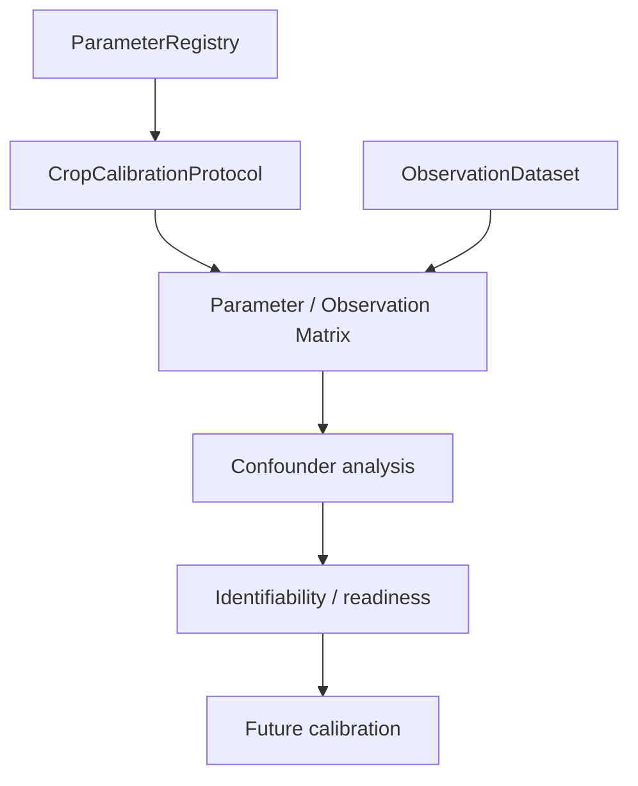

# Phase 5.14: parameter identifiability and calibration readiness

## Objetivo y alcance

Phase 5.14 analiza qué parámetros del modelo podrían estudiarse en una futura calibración, qué observables necesitarían y qué confounders deben resolverse. No ejecuta fitting, optimización, `GridSearchCalibrator`, actualización de parámetros ni data assimilation.

La única fuente de parámetros es `ParameterRegistry`. La capa nueva reutiliza `ParameterRecord` y `CropCalibrationProtocol`; no crea un registry, observación, dataset, métrica, reloj o scheduler alternativo.

## Jerarquía científica

```text
parameter exists
  -> scientific meaning
  -> calibration_allowed
  -> appropriate observations
  -> stage/environment coverage
  -> distinguishable effect
  -> confounders controlled
  -> future identifiability
  -> future calibration
  -> independent validation
```

`calibration_allowed` es permiso de contrato, no evidencia de identificabilidad. Un parámetro permitido puede quedar `INSUFFICIENT_DATA` o `CONFOUNDED`. Los parámetros no permitidos quedan `FIXED`; los marcados `not_applicable` quedan `NOT_CALIBRATABLE`.

## Arquitectura

`ParameterIdentifiabilityAnalyzer` produce `ParameterIdentifiability` por cada `ParameterRecord`. El informe `IdentifiabilityReport` es inmutable y serializable. La operación es de solo lectura:



## Estados

- `NOT_CALIBRATABLE`: el contrato marca el parámetro como no aplicable.
- `FIXED`: el contrato no permite calibrarlo.
- `CANDIDATE`: hay una relación conceptual, pero faltan garantías de identificación.
- `INSUFFICIENT_DATA`: faltan observaciones, cobertura o datos científicos reales.
- `IDENTIFIABLE`: reservado para una futura evaluación con observables, cobertura, permiso y confounders resueltos. La implementación actual no lo asigna de forma automática.
- `CONFOUNDED`: existe un grupo de parámetros relacionado cuyo efecto no está separado.
- `VARIETY_SPECIFIC`: el registro tiene scope de variedad; esto no significa que esté calibrado.
- `ENVIRONMENT_SPECIFIC`: el registro pertenece a greenhouse/feedback o depende del ambiente; requiere datos de sitio.

## Matriz parámetro-observación

Cada resultado conserva ID, nombre, crop, variedad, parcela, etapa, subsystem, categoría, observables sugeridos, tipos de observación requeridos, cobertura ambiental/etapa, provenance, evidence, confidence, permiso de calibración, status actual, confounders y warnings.

Los observables se derivan únicamente del texto de requisitos existente en `ParameterRecord.observational_data_required` y no inventan frecuencias ni cantidades mínimas. Cuando el registry no documenta resolución temporal, método o incertidumbre, esos campos permanecen desconocidos.

## Confounders

La matriz agrupa solo parámetros presentes en el registry en hipótesis de confounding: growth scaling, radiation interception, phenology, water stress, VPD, CO2, senescence/damage y fruit development. Una coincidencia de nombres es una alerta estructural, no una afirmación de confounding fisiológico demostrado. Los parámetros relacionados se conservan explícitamente para el diseño futuro de observaciones.

## Readiness por scope

El análisis puede filtrarse por especie, variedad, parcela y ambiente. Usa las variedades conocidas `tomato/RAF`, `pepper/Lamuyo`, `grape/Monastrell` y `plum/Suplum 26`; para lettuce, apple y peach no inventa variedades locales. La presencia de un plot o variedad en configuración no cuenta como observación ni eleva readiness científica.

Los datos sintéticos, forcing meteorológico y literatura de `crop_phenology.csv` no son observaciones agronómicas locales. Si el dataset es `synthetic_test_data`, el informe marca `synthetic_data_only` y mantiene los parámetros no identificables. En el estado actual: `REAL AGRONOMIC DATA NOT AVAILABLE`.

## Integración futura

La salida queda preparada para el flujo:

```text
ParameterRegistry
  -> CropCalibrationProtocol
  -> ObservationDataset
  -> TemporalAlignment
  -> ComparisonDataset
  -> ErrorDiagnostics
  -> ParameterIdentifiabilityAnalyzer
  -> future CalibrationCase
```

La fase actual no crea automáticamente `CalibrationCase`, no modifica `TwinState`, snapshots, observations, `ParameterRegistry`, `ParameterSet`, `SimulationClock` ni scheduler.

## Tests y limitaciones

`tests/test_parameter_identifiability.py` cubre los siete cultivos, variedades conocidas, datos sintéticos, fixed/not-applicable, confounders, serialización, determinismo y no mutación. El manual es `manual_phase5_14_parameter_identifiability_test.py`.

No se implementa sensibilidad cuantitativa porque no existía una infraestructura establecida y no es necesaria para una evaluación conservadora. Tampoco se inventan umbrales de cobertura, número de campañas, frecuencia o tamaño muestral. La identificabilidad formal requiere datos reales apropiados, diseño experimental y análisis posterior.

**CALIBRATION NOT PERFORMED**  
**DATA ASSIMILATION NOT IMPLEMENTED**  
**EXPERIMENTAL VALIDATION NOT CLAIMED**  
**REAL AGRONOMIC DATA NOT AVAILABLE**

**PHASE 5.14 COMPLETE — PARAMETER IDENTIFIABILITY / CALIBRATION READINESS FRAMEWORK READY — REAL AGRONOMIC DATA NOT AVAILABLE — CALIBRATION NOT PERFORMED — EXPERIMENTAL VALIDATION NOT CLAIMED**
